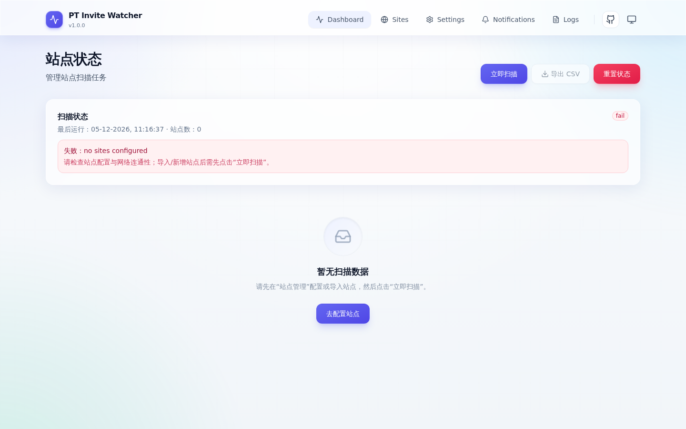

# PT Invite Watcher

长期运行的 PT 站点 **开放注册 / 可用邀请数 / 连通性** 监控服务（默认支持 NexusPHP 与 M-Team），站点列表来源于 MoviePilot 或手动配置，Cookie 优先从 CookieCloud 获取并支持回退。所有运行配置可在 Web UI 中热更新，不需重启容器。

## 📸 界面预览



## ✨ 功能特性

- **多源站点管理**
  - **MoviePilot 拉取**：自动同步 MP 已认证站点（带本地缓存与 token 续期）。
  - **手动添加**：支持任意 NexusPHP 站点 / M-Team / 自定义 path 模板。
  - **CookieCloud 同步**：周期性刷新 Cookie，失败回退到 MoviePilot 或本地配置；策略可在配置页切换 `auto / cookiecloud / moviepilot`。
- **全方位监控**
  - **开放注册**：检测 `signup.php` 或注册页关键字。
  - **邀请名额**：解析首页 / 个人中心 / 邀请页，智能识别等级权限与名额数量；M-Team 走专用 JSON API。
  - **连通性**：实时检测可达性、记录 HTTP 状态、自动判定受限（403）。
- **现代 Web UI（Vue 3 + Tailwind 3）**
  - **响应式**：桌面表格、移动卡片、底部 Dock 三态自适应；中间断点也保持有可用导航。
  - **实时日志**：WebSocket 流式推送扫描事件，支持按分类 / 站点 / 关键字过滤；高频事件用 rAF 批处理避免抖动。
  - **暗色模式**：跟随系统或手动切换；5 种品牌主题色（Indigo / Emerald / Rose / Amber / Violet）持久化存储。
  - **数据大屏**：4 KPI（总站点 / 开放注册 / 开放邀请 / 异常），单站点与全量扫描进度可视化。
- **通知触达**
  - Telegram Bot（含失败重试与去重）。
  - 企业微信应用消息（access token 缓存）。
  - 控制台测试发送、敏感字段后端密文存储。
- **运维友好**
  - 备份 / 恢复（`/api/backup/export|import`，可选包含密钥，merge / replace 两种模式）。
  - 多进程共享 SQLite 时的 **leader lock**（基于 kv 表分布式租约），避免重复扫描。
  - **scheduler 自动告警**：连续 3 次失败会写入 `event_log`（前端日志页可见）。
  - **日志缓冲 + 索引**：扫描事件先入内存队列再异步落库；event_log 已为 `category / domain / id` 建索引。

## 🚀 快速开始

### 1. Docker 部署（推荐）

**Docker Compose**：

```yaml
services:
  pt-invite-watcher:
    image: helloworldz1024/pt-invite-watcher:latest
    container_name: pt-invite-watcher
    restart: unless-stopped
    ports:
      - "8003:8080"
    volumes:
      - ./data:/data
    environment:
      PTIW_DB_PATH: "/data/ptiw.db"
      # 可选：开机即可用 MoviePilot / CookieCloud
      MP_BASE_URL: "http://moviepilot:3001"
      COOKIECLOUD_BASE_URL: "http://cookiecloud:8088"
      # 可选：Web UI BasicAuth
      PTIW_WEB_AUTH_USERNAME: "admin"
      PTIW_WEB_AUTH_PASSWORD: "change-me"
```

```bash
docker compose up -d
# 访问 http://localhost:8003
```

**Docker Run**：

```bash
docker run -d \
  --name pt-invite-watcher \
  --restart always \
  -p 8003:8080 \
  -v "$(pwd)/data:/data" \
  -e PTIW_DB_PATH="/data/ptiw.db" \
  -e MP_BASE_URL="http://moviepilot:3001" \
  -e COOKIECLOUD_BASE_URL="http://cookiecloud:8088" \
  helloworldz1024/pt-invite-watcher:latest
```

### 2. 本地开发

依赖：Python 3.10+、Node.js 18+。

```bash
# 后端
python3 -m venv .venv
source .venv/bin/activate
pip install -r requirements.txt
python3 -m pt_invite_watcher run            # 启动 Web UI + 调度器
python3 -m pt_invite_watcher check-once     # 跑一次扫描后退出（调试用）

# 前端（修改 webui/src 后必须重新 build）
cd webui
npm install
npm run build       # 输出到 pt_invite_watcher/webui_dist
npm run dev         # 或开发服务器（自动代理 /api 与 /ws 到本地 8080）
```

后端启动时会检测 `webui/src` 与 `webui_dist` 的时间戳，若 src 更新但 dist 未重建会打 WARNING。

## 🛠️ 配置说明

所有运行参数都可以在 Web UI（`/config`、`/notifications`）中可视化管理；下表的环境变量只是「首次启动的种子」。

### 启动期环境变量（修改需重启）

| 变量名 | 说明 | 默认值 |
| :--- | :--- | :--- |
| `PTIW_CONFIG` | 自定义 YAML 配置路径（覆盖默认） | - |
| `PTIW_DB_PATH` | SQLite 数据库路径 | `./data/ptiw.db` |
| `PTIW_WEB_HOST` | HTTP 监听地址 | `0.0.0.0` |
| `PTIW_WEB_PORT` | HTTP 端口 | `8080` |
| `PTIW_WEB_AUTH_USERNAME` | Web UI BasicAuth 用户名 | (无) |
| `PTIW_WEB_AUTH_PASSWORD` | Web UI BasicAuth 密码 | (无) |
| `PTIW_DISABLE_AUTH` | 强制禁用 BasicAuth | `0` |
| `PTIW_DISABLE_SCHEDULER` | 禁用后台定时扫描（仅手动触发） | `0` |
| `PTIW_DISABLE_LEADER_LOCK` | 禁用 scheduler leader lock（多实例共 DB 时慎开） | `0` |
| `PTIW_LOG_LEVEL` | 日志级别 `DEBUG/INFO/WARNING/ERROR` | `INFO` |

### 扫描参数（也可在 WebUI 热改）

| 变量名 | 说明 | 默认值 |
| :--- | :--- | :--- |
| `PTIW_SCAN_INTERVAL_SECONDS` | 扫描周期（秒） | `600` |
| `PTIW_SCAN_TIMEOUT_SECONDS` | 单次请求超时（秒） | `20` |
| `PTIW_SCAN_CONCURRENCY` | 并发站点数 | `8` |
| `PTIW_USER_AGENT` | 自定义 UA（建议覆盖以贴合站点风控） | (空) |
| `PTIW_SCAN_TRUST_ENV` | 是否信任系统代理变量 (`HTTPS_PROXY` 等) | `0` |

### 数据源

| 变量名 | 说明 | 默认值 |
| :--- | :--- | :--- |
| `MP_BASE_URL` | MoviePilot 服务地址 | - |
| `MP_USERNAME` / `MP_PASSWORD` / `MP_OTP_PASSWORD` | MoviePilot 登录凭证 | - |
| `COOKIE_SOURCE` | Cookie 优先级 `auto / cookiecloud / moviepilot` | `auto` |
| `COOKIECLOUD_BASE_URL` | CookieCloud 服务地址 | - |
| `COOKIECLOUD_UUID` / `COOKIECLOUD_PASSWORD` | CookieCloud 凭证 | - |
| `COOKIECLOUD_REFRESH_INTERVAL_SECONDS` | Cookie 同步周期（秒） | `300` |

### Cookie 解析顺序

`auto` 模式下 Cookie 解析链路：

```
CookieCloud（最新一次成功的快照）
   ↓ 失败 / 缺该域名
MoviePilot（站点配置中的 cookie 字段）
   ↓ 失败 / 站点未托管
本地手动配置
```

## 📦 备份与恢复

| 操作 | 入口 |
| :--- | :--- |
| 导出整套配置（含 / 不含密钥） | `配置管理 → 导出` 或 `GET /api/backup/export?include_secrets=1` |
| 导入配置（merge / replace 两种模式） | `配置管理 → 导入` 或 `POST /api/backup/import?mode=merge` |

`merge` 会保留本地敏感字段（密码、token），`replace` 完全以备份为准。导入完成后若检测到站点配置变化会提示「立即扫描」。

## 📱 多端适配

- 桌面端：表格视图 + 顶部导航。
- 平板 / 横屏手机：保持顶部导航（已修复中间断点空窗）。
- 手机：日志 / 站点列表自动切换为卡片视图，导航变成底部 Dock；启用了 `pb-safe` 兼容刘海屏。

## 🔭 实时与可观测

- **WebSocket**：客户端订阅 `/ws/events`，实时收到 `dashboard_update` / `logs_append` / `logs_update` 事件。
- **断线重连**：前端实现指数退避（1s→30s）+ 抖动 + 页面可见性感知，避免连接风暴。
- **背压保护**：服务端日志事件队列满会发送一次 `logs_update` 让客户端 resync。
- **告警事件**：scheduler 连续失败会以 `error` 级别写入 `event_log`，恢复后写一条 `info` 记录。

## 📱 桌面 / 移动客户端

除浏览器之外，本项目还提供 **Windows / macOS / Linux 桌面 app**（Tauri 2 壳 + 内嵌 Python sidecar，可离线本地运行）以及 **iOS / Android 移动 app**（远程模式，连接自托管服务器）。

```bash
npm install
npm run sidecar:build       # 仅本地模式需要
npm run tauri:build         # Windows / macOS / Linux 打包
npm run tauri:android:build # Android
npm run tauri:ios:build     # iOS（需 macOS + Xcode）
```

完整的构建、签名、公证、上架流程见 [`docs/multi-platform.md`](docs/multi-platform.md)。

## ⚠️ 免责声明

本项目仅用于「站点状态监控与通知」，不包含任何绕过验证、突破安全机制、自动抢注或获取邀请码的功能。请遵守各站点规则。
